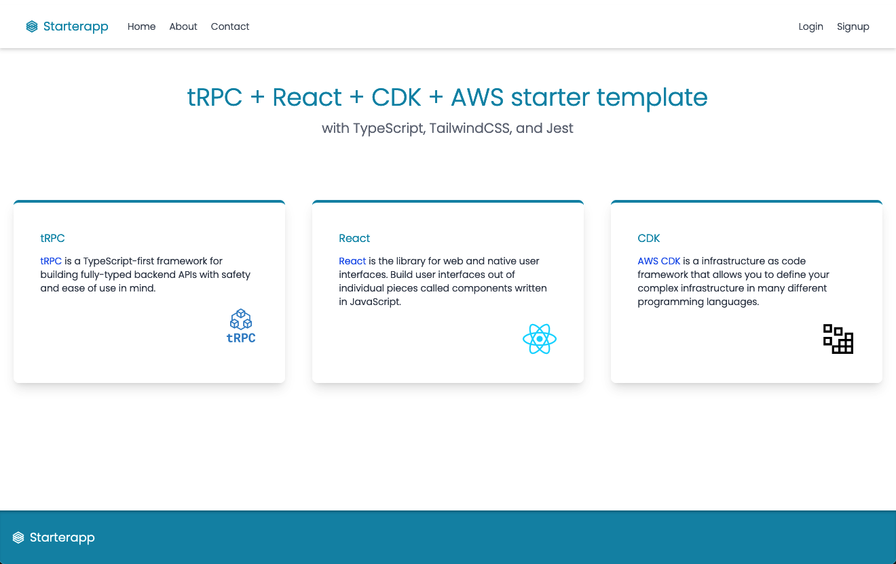
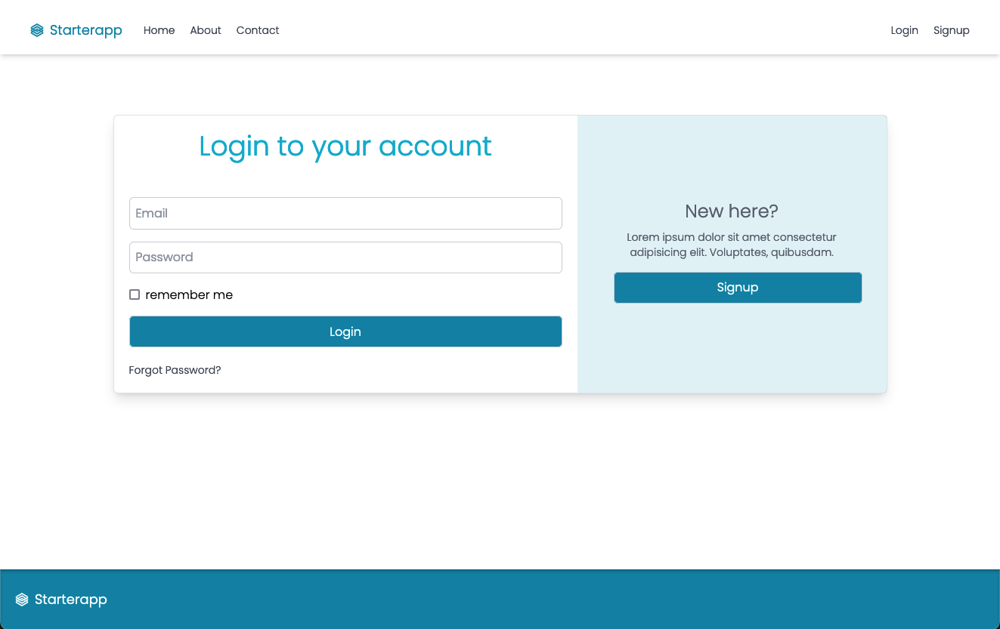
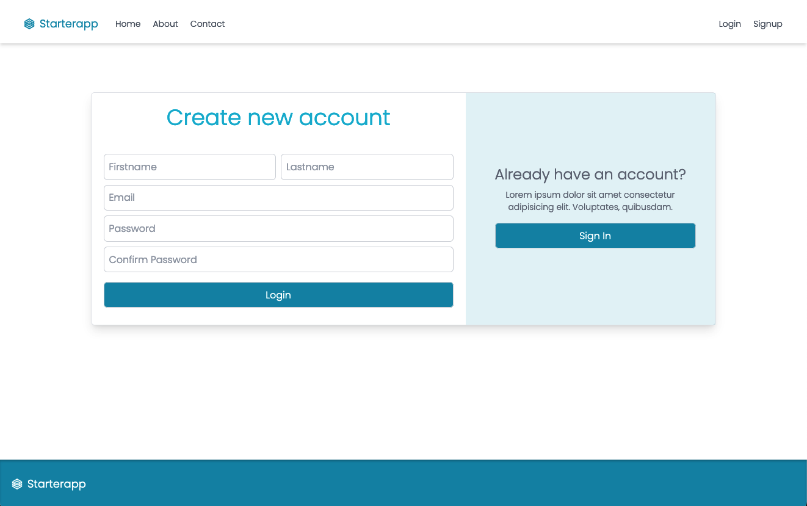

# tRPC + React.js + postgres + AWS CDK Starter [WIP]

This is a starter project that uses tRPC, React.js, and AWS CDK. It's written in TypeScript and uses Yarn as the package manager.

## Project Structure

This repository uses `yarn workspaces` and contains following packages,

- Server
- Client (Frontend client - vite + react + tailwind)
- Database Migrations (Knex for migrations)
- Database client (Used by server to connect with postgres)
- Schemas (JSON Schemas common for Frontend and Server)
- Infrastructure (uses AWS CDK for deployments)

## Getting Started

1. Clone the repository.
2. Install the dependencies with `yarn install`.
   - Follow the instructions at [Yarn Website](https://yarnpkg.com) to install using `corepack`
3. Copy `.env.sample` to `.env` and fill in your environment variables for each package.
4. Build `schemas` & `dbclient` using `yarn dbclient:build` & `yarn schemas:build`
5. Start the server with `yarn server:start`.
6. Start the client using `yarn client:start`.

> For VSCode use the `starter.code-workspace` file to open the workspace

## Testing

- Run tests with `yarn dbclient:test` for testing dbclient.
- Run tests with `yarn server:test` for testing server.
- Run tests with `yarn client:test` for testing the client.

## Building

Build the application with `yarn build`.

## Contributing

Pull requests are welcome. For major changes, please open an issue first to discuss what you would like to change.

## Screens

## License

[MIT](https://choosealicense.com/licenses/mit/)
